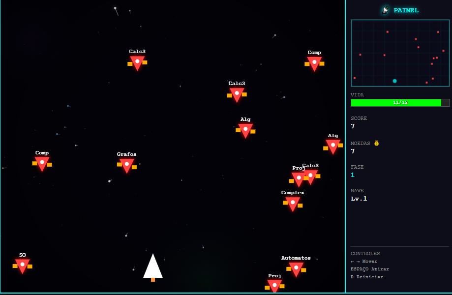
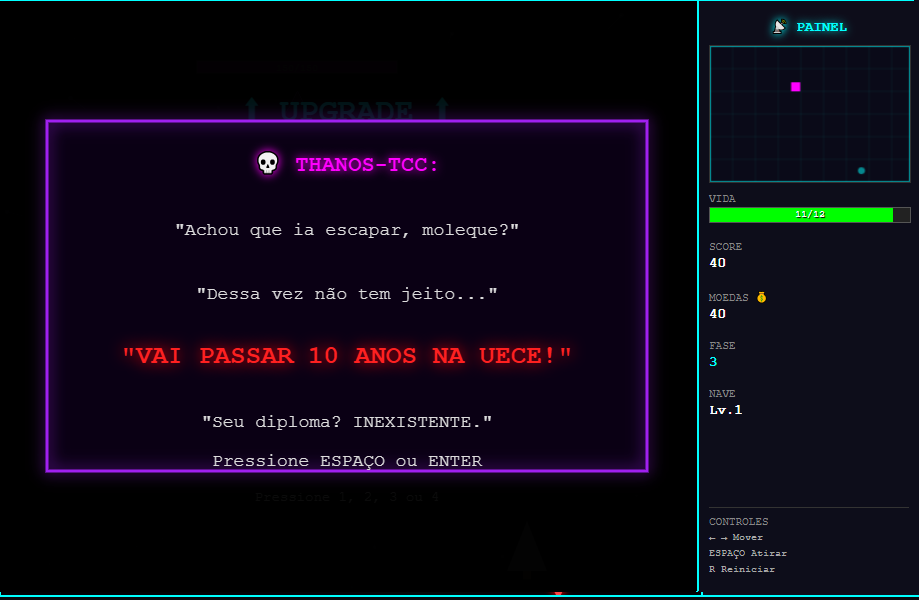

# Semester-Blaster

O **Semester-Blaster** é um shooter espacial de progressão lateral desenvolvido como projeto prático para a disciplina de Computação Gráfica. O jogo transpõe a experiência acadêmica para uma mecânica de combate, onde cada inimigo representa uma disciplina do curso e o desafio final culmina no confronto contra o TCC.

## Visualização do Projeto

  
    
  
    
  

---

## Equipe
* **Desenvolvedor:** Hyan Victor Cunha Gomes
* **Testadora e Quality Assurance:** Yasmin
* **Instituição:** Universidade Estadual do Ceará (UECE)
* **Disciplina:** Computação Gráfica

## Requisitos Contemplados

O projeto foi construído em JavaScript puro, implementando manualmente os algoritmos fundamentais de computação gráfica sem dependência de bibliotecas externas de renderização.

* **Set Pixel:** Manipulação direta do buffer de imagem via ImageData.
* **Primitivas de Rasterização:** Implementação dos algoritmos de Linha (Bresenham), Círculo e Elipse (Ponto Médio).
* **Preenchimento de Regiões:** Algoritmos de Flood Fill e Scanline para preenchimento de polígonos.
* **Transformações Geométricas:** Aplicação de Rotação, Translação e Escala em objetos 2D.
* **Animação 2D:** Controle de ciclos de animação e estados de sprites.
* **Janela e Viewport:** Sistema de coordenadas para mapeamento de mundo e visualização.
* **Recorte (Clipping):** Implementação do algoritmo de Cohen-Sutherland para clipping de linhas.
* **Mapeamento de Textura:** Renderização do Boss desenhado 100% no pixel buffer e uso de texturas externas.
* **Input:** Gerenciamento de entradas via teclado para movimentação e ações.
* **Interface:** Menus e interações gráficas avançadas para upgrade e HUD.

## Mecânicas de Jogo

* **Dificuldade Adaptativa:** Três níveis de dificuldade que alteram o comportamento e resistência dos inimigos.
* **Sistema de Upgrade:** Loja entre fases para melhoria de cadência de tiro e alteração do modelo da nave.
* **New Game Plus (NG+):** Modo desbloqueado após a conclusão do jogo, com dificuldade elevada e a nave exclusiva da UECE.
* **Sistema de Password:** Utilização de códigos específicos para saltar entre os semestres.

## Como Executar

O jogo é executado diretamente no navegador. Basta abrir o arquivo `index.html`.

**Controles:**
* **Setas (Esq/Dir) ou A/D:** Movimentação.
* **Espaço:** Atirar / Confirmar Diálogos.
* **R:** Reiniciar partida.
* **M:** Voltar ao menu (após vitória).

---

### Observações Técnicas
Este software foi desenvolvido com o propósito de demonstrar o domínio sobre algoritmos de baixo nível de rasterização e manipulação gráfica 2D, priorizando a implementação manual em vez de motores de jogo comerciais.